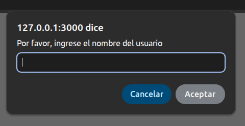
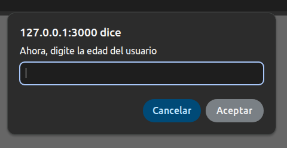
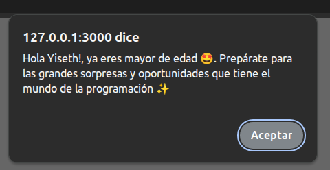
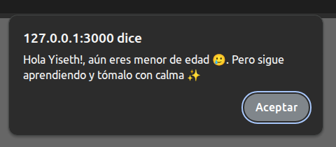
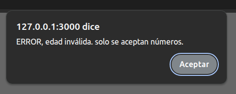

JAVASCRIPT

✨ Título ✨ 
Captura de datos, validación y condicionales

📝 Descripción 📝
En este taller puse en práctica los conceptos básicos de JavaScript, como la declaración de variables, los tipos de datos, las estructuras condicionales, y la entrada y salida de datos. A través de esta actividad, desarrollé un pequeño sistema interactivo que permitirá al usuario ingresar datos y recibir mensajes dinámicos de manera estructurada. Así tambipen como agregué un poco de HTML y CSS para darle un plus visual.

💻 Tecnologías 💻
1. Visual Studio Code: Editor de texto para escribir y editar el código HTML y JavaScript.
2. Navegador web: Ejecutar el código HTML y JavaScript y vaya mostrando el resultado en la interfaz.

🤓 Uso 🤓

Ingresamos el nombre del usuario

Ingresamos la edad del usuario

Debería mostrar este mensaje cuando el usuario es mayor de edad

Y este otro cuando el usuario es menor de edad

En el caso que el usuario ingrese un dato incorrecto en el campo edad, se mostrará así:

📞 Contacto 📞
Nombre: Yiseth Gutiérrez 
Teléfono: 3206781487
Correo: gutierrezyiseth3@gmail.com
GitHub: @yxdth3

